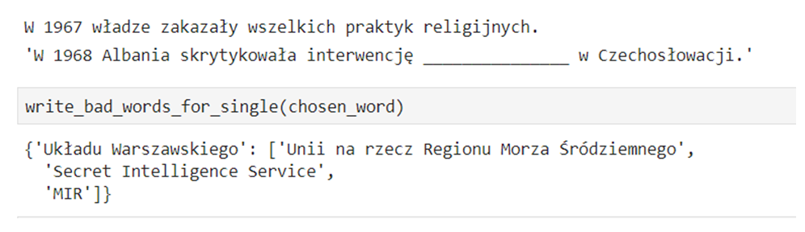
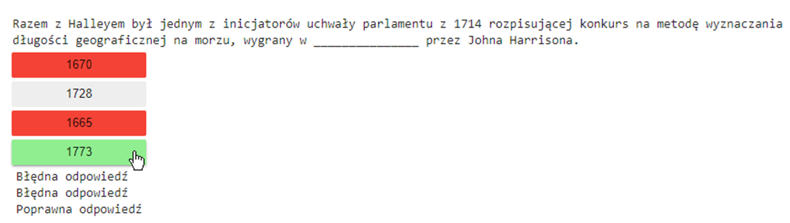

# WikiQuiz
<h2>Opis</h2>
WikiQuiz ma na celu przeanalizowanie dowolnego artykułu z polskiej Wikipedii i wygenerowanie na jego podstawie pytań dla użytkownika z maksymalnie 4 możliwymi wariantami odpowiedzi. Pytanie ma formę wylosowanego zdania z luką (usuniętym wyrazem lub wyrazami), którą użytkownik musi uzupełnić wskazując jedną z zaproponowanych odpowiedzi.

<h2>Motywacja</h2>

* Zaznajomienie się z podstawami NLP
* Stworzenie własnych funkcji odpowiedzialnych za deklinację rzeczowników

<h2>Cel</h2>
Projekt zaliczeniowy w ramach programu studiów

